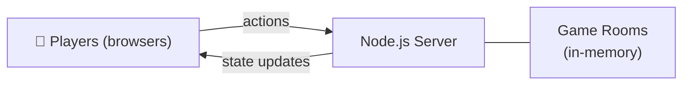

# Jigsaw Solver

Real-time multiplayer jigsaw puzzle game. Players share a room, drag pieces from a tray onto a board, and race to complete the puzzle.

**Docker Hub:** `dipankan001/jigsaw-solver:v2`

---

## Architecture



- Server is the single source of truth — clients send intent (`pick`, `move`, `drop`), server validates and broadcasts.
- Rooms are created on first join and deleted when the last player disconnects.
- Timer is issued as an absolute `timerEndsAt` timestamp so all players stay in sync regardless of join time.

---

## Features

- **Multiplayer** — 20+ players per room, each with a unique color, live cursor, and score
- **Room codes** — join an existing room or auto-generate a new one
- **Puzzle config** — piece count (64–256), time limit (5–30 min or ∞), and starting image set at room creation
- **Custom images** — any JPEG/PNG/WebP/SVG URL; changeable mid-game, synced to all players
- **Board overlay** — ghost image behind the grid as a solving aid; toggled per-user, persisted in `localStorage`
- **Leaderboard + feed** — live scores ranked by pieces placed; last five placements in a activity feed
- **Responsive** — scales to any viewport via CSS `transform: scale()`, no layout rewrite

---

## Scalability

The in-memory room store works well on a single process. To scale horizontally:

1. **Sticky sessions** — pin clients to the same instance via load balancer cookie affinity
2. **Redis adapter** — add `@socket.io/redis-adapter` to fan out events across instances
3. **State persistence** — serialize `GameRoom.getState()` to Redis or a DB to survive restarts

A single `node:20-alpine` container serves 500+ concurrent players comfortably on 512 MB RAM.

---

## Deployment

### Local
```bash
npm install && npm start        # http://localhost:3001
npm run dev                     # hot-reload via node --watch
```

### Docker
```bash
docker run -d -p 3001:3001 dipankan001/jigsaw-solver:v5

# custom port
docker run -d -p 8080:8080 -e PORT=8080 dipankan001/jigsaw-solver:v5
```

### Cloud
Works on any container platform (Railway, Render, Fly.io, ECS, Cloud Run, Azure Container Apps). Set target port to `3001`. Ensure WebSocket pass-through is enabled on any reverse proxy.

| Variable | Default | |
|---|---|---|
| `PORT` | `3001` | HTTP server port |
| `NODE_ENV` | `production` | Set in Docker image |
